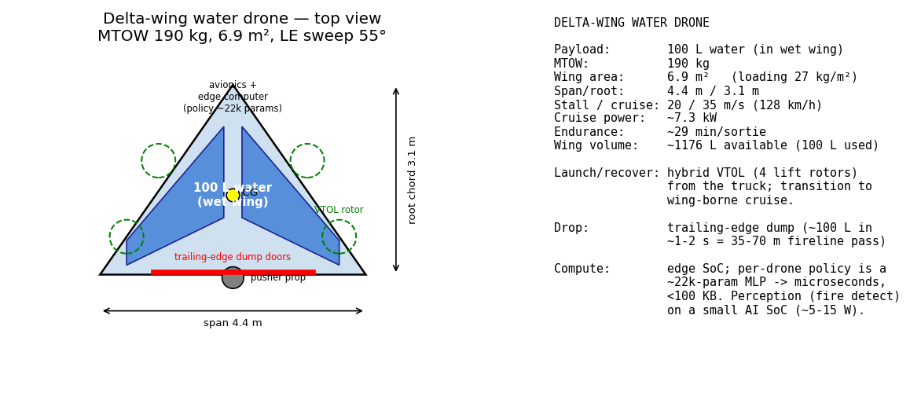

# Delta-wing water drone (100 kg payload, wet wing, onboard policy)

The forest-fire sweep showed the binding constraint is **per-drop payload** (~100 L),
not fleet size. This is a first-order concept for a drone that carries that 100 L
**inside the wing** ("wet wing"), runs the trained per-drone policy on a small
onboard computer, and launches from the trucks.

## Concept

A tailless **delta** (≈55° leading-edge sweep). Water is held in **integral
wet-wing tanks** rather than a separate fuselage tank — exactly how aircraft
carry fuel in their wings. Benefits:
- **No tank weight/volume penalty** — the wing *is* the tank.
- **Mass near the CG and spread along span** → good balance and wing-bending
  relief; CG barely shifts as it dumps if the tank straddles the CG.
- The delta's deep root gives plenty of volume (~1,180 L available; only 100 L used).

## First-order sizing (computed in `scripts/drone_design.py`)

| | value |
|---|---|
| Water payload | **100 L (100 kg)** |
| MTOW | ~190 kg (water 100 + airframe 35 + battery 25 + propulsion 12 + VTOL 14 + avionics 4) |
| Wing area | ~6.9 m² (loading ~28 kg/m²) |
| Span / root chord | 4.4 m / 3.1 m, LE sweep ~55° |
| Stall / cruise | 20 / 35 m/s (~128 km/h) |
| Cruise power | ~7.3 kW |
| Endurance | ~29 min/sortie (25 kg battery @ 200 Wh/kg) |
| Wing internal volume | ~1,180 L available (100 L used) |

(Lift equation `W = ½ρv²S·CL`; rough L/D≈9; battery Wh/kg≈200. These are
back-of-envelope — real design needs CFD, structures, and stability analysis.)

## Operations

- **Launch/recovery: hybrid VTOL** — 4 lift rotors let it take off vertically
  from a truck and transition to wing-borne cruise (a pure delta can't hover or
  use a runway in the field). This adds ~14 kg but makes truck-based ops viable.
- **Drop: trailing-edge dump doors** release ~100 L in ~1–2 s → at 35 m/s that
  coats a **35–70 m fireline in a single pass**.

## Onboard computer

The trained decentralized policy is **tiny**: an MLP `[128,128]` over a ~43-dim
egocentric observation ≈ **22k parameters (<100 KB)**, inference in microseconds.
It runs comfortably on a **microcontroller-class chip**. The heavier job is
*perception* (detecting the active fire front from an onboard IR/optical sensor),
which wants a small edge-AI SoC (~5–15 W). So "small computer" is literal — the
intelligence is cheap; sensing is the cost.

## Honest caveat: this changes the ops model vs. the sim

The simulation assumes **hovering** drones that loiter over a cell and dribble
water. A delta-wing **cannot hover** — it makes **fast bombing passes** (like a
mini water-bomber). That actually fits the forest finding (big payload, decisive
drops) better than dribbling, but to model it faithfully the sim would need a
**"pass" drop** (deposit ~100 L along a 35–70 m line at speed) rather than the
current hover-and-drop. A quadcopter-style airframe would match the sim but can't
carry 100 L efficiently. The realistic answer is probably a **mix**: heavy-lift
fixed-wing/VTOL deltas for volume on the main front, small multirotors for
precision mop-up and spot fires.
