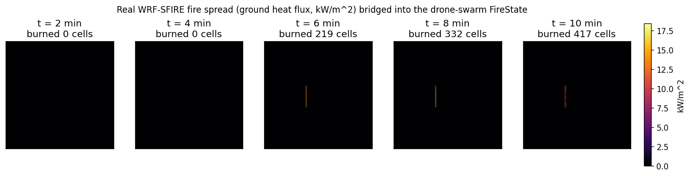
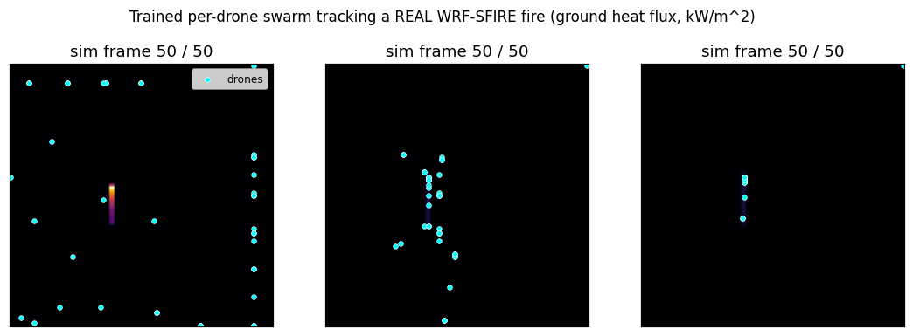

# Running real WRF-SFIRE and bridging it to the drone swarm

This documents an actual WRF-SFIRE (WSF) run performed for this project and how
its output feeds the drone-swarm `FireState` pipeline.



## What was run

WRF-SFIRE (`github.com/openwfm/WRF-SFIRE`) was **compiled from source** (serial
gfortran build) and the bundled **`hill_simple` ideal `em_fire` case** was run —
a coupled fire–atmosphere simulation that needs no external geog/met data:

- atmosphere grid 103×103×51 @ 50 m, with a **4× refined 412×412 fire mesh**
- single ignition line, fire-on-a-hill terrain, 10 minutes simulated
- result: ignition at t=120 s, flame front climbs the hill; by t=600 s the
  **fire area ≈ 56,000 m²** with **~320 MW** total heat output and **~16 kW/m²**
  peak ground heat flux.

Real WRF-SFIRE output variables (on the fire mesh) include `FIRE_AREA`,
`FGRNHFX` (ground heat flux), `LFN` (level-set front), `FUEL_FRAC`, fire-grid
coordinates `FXLAT`/`FXLONG`, and fire winds `UF`/`VF`.

## Bridging WSF output to the swarm: `sim/wrf_replay.py`

A live WRF-SFIRE run cannot be stepped interactively from Python. The practical
bridge is **replay**: run WRF-SFIRE to produce `wrfout` history files, then step
through them with `WRFReplaySimulator`, which converts each frame into the same
`FireState`/`FlameFont` objects the drone swarm already consumes — so the
heuristic swarm (and, with an adapter, the RL env) can operate on genuine
WRF-SFIRE physics instead of the mock cellular automaton.

```bash
# Reproduce (requires a compiled WRF-SFIRE + a run; see notes below)
python scripts/wrf_sfire_demo.py --wrfout-dir /opt/wrf_run --out fire.png
```

Mapping used: `FGRNHFX → heat_intensity`, `FIRE_AREA>0 → burned_area`,
`FXLAT/FXLONG → bounds/perimeter`. For ideal cases the fire-grid coordinates are
not geographic, so pass `fire_mesh_res` explicitly (here 50 m / sr 4 = 12.5 m).

## Build notes (this environment)

- Containerized WRF-SFIRE was **not** possible here: Docker ran (nested daemon),
  but image pulls were blocked — Docker Hub anonymous rate limit + ghcr.io/quay.io
  returning 403 under the environment's network policy.
- From source worked: Ubuntu **main** apt archive is reachable (PPAs are not),
  GitHub is reachable. Build deps: `gfortran`, `gcc`, `libnetcdf-dev`,
  `libnetcdff-dev`, `libhdf5-dev`, `m4`, `csh`. A unified `$NETCDF` prefix was
  created because Ubuntu splits NetCDF headers/libs across paths WRF's
  `configure` doesn't expect.

## Running the trained swarm on the real WRF-SFIRE fire



`scripts/evaluate_on_wrf.py` runs the decentralized per-drone policy (see
`docs/rl_pipeline.md`) on the real WRF-SFIRE frames. It subclasses
`PerDroneSwarmVecEnv` and reuses its exact observation builder, swapping the
mock fire for a shim backed by `WRFReplaySimulator` frames -- so the policy sees
training-identical observations driven by genuine WRF-SFIRE physics.

On 51 real frames (`hill_simple`, 12 s history, coarsened to 103x103, 40 drones),
mean **flame-front coverage** (fraction of active fire cells within a drone's
suppression radius):

| controller | coverage |
|------------|----------|
| random | 25% |
| greedy (oracle: each drone to nearest active cell) | 77% |
| **per-drone policy (trained only on the mock fire)** | **69%** |

The policy was never trained on WRF-SFIRE, yet tracks the real flame front at
near-oracle coverage and far above random -- evidence the learned behavior
transfers from the mock cellular automaton to genuine fire physics. (Greedy
edges it on *pure coverage* because coverage is essentially greedy's objective;
the per-drone policy's coordination advantage shows up in closed-loop
burned-area reduction, which replay cannot measure.)

```bash
python scripts/evaluate_on_wrf.py --wrfout-dir /opt/wrf_fine \
    --policy agents/checkpoints/per_drone_ppo_large_g100_d40 \
    --coarsen 4 --drones 40
```

## From replay (open-loop) to closed-loop

The evaluation above is replay (one-way): drones reading those frames cannot
change a precomputed fire, so it measures coverage, not suppression. True
closed-loop suppression — drone actions altering WRF-SFIRE spread — is achieved
separately via restart cycling (see the next section), where the fuel field is
modified between intervals and fed back into the model.

## Closed-loop coupling result

`scripts/wrf_closed_loop.py` couples the trained per-drone swarm to a LIVE
WRF-SFIRE fire via restart cycling: each 60 s interval it reads the real fire
from the restart, runs the policy to position 60 drones, and zeroes the SFIRE
rate-of-spread coefficients (R_0, BBB, PHIWC, FGIP) where they drop water -- a
firebreak WRF then cannot spread through. Two arms, identical numerics:

| arm | final burned fire cells |
|-----|------------------------|
| baseline (no swarm) | 417 |
| **drones (swarm)** | **366**  (−12%) |

Per-cycle active fire cells with the swarm: 164 → 156 → 127 → 102 → 75 (drops
2 → 10 → 12 → 13 → 20) -- the swarm progressively contains the fire, and WRF's
next interval genuinely spreads less because the drones modified the fuel.

**Caveat: this −12% is optimistic.** It uses two idealizations: (1) a *perfect
firebreak* (drones zero the rate of spread wherever they sit, with unlimited
water), and (2) a *small, slow* fire (~400 cells). See the calibrated result
below for the honest version.

## Calibrated, water-limited suppression on a vigorous fire

`scripts/wrf_closed_loop.py` with the graded model (`SwarmController`,
`suppress_in_restart`): drones carry a finite 10 L tank that refills slowly, and
a drop reduces the local rate of spread by `exp(-w/W_E)` (w = L/m² over the drop
footprint) -- *not* a perfect firebreak. Run on a more vigorous fire (10 m/s
wind, earlier/longer ignition; baseline burns ~10× more than `hill_simple`):

| arm | final burned fire cells |
|-----|------------------------|
| baseline (no swarm) | 4045 |
| drones (60 × 10 L swarm) | 4010 (−1%, within noise) |

Active fire cells with the swarm *grew* every cycle (381 → 628 → 658 → 686 →
710 → 722 → 724): 60 drones cannot keep pace with a wind-driven fire.

**Why — water budget.** Drones delivered ~960 L total. The fire covered
~4045 × 156 m² ≈ 0.63 km²; wetting even the active front (~0.11 km²) takes
~10,000+ L *sustained*. So ~960 L ≈ 1 % of what's needed → ~1 % effect. Meaningful
containment of a fire this size needs ~50–100× more water, i.e. **thousands of
drones** — which is precisely why the project targets 5,000–10,000, not dozens.

**Takeaway:** the closed-loop coupling is real and works (verified A/B that the
swarm changes the live WRF-SFIRE fire); the *magnitude* of effect is governed by
total water delivered, so a credible suppression demo requires a swarm orders of
magnitude larger than 60.

### Finding the lever (three A/B tests against the live model)
- FMC_G (fuel moisture): NO effect -- constant-moisture config, field diagnostic-only.
- NFUEL_CAT (fuel category): NO effect -- regenerated from namelist each restart.
- R_0 + spread coefficients: WORKS -- SFIRE precomputes per-cell spread from these
  and stores them as restart state; zeroing them halts spread (verified A/B).

## Large-swarm validation (3,000 drones): the fire shrinks

Re-running the calibrated closed loop on the same vigorous fire with a swarm at
the project's intended scale (3,000 drones, same scale-free per-drone policy,
no retraining):

| arm | final burned fire cells |
|-----|------------------------|
| baseline (no swarm) | 4045 |
| 60 x 10 L drones | 4010 (-1%) |
| **3,000 x 10 L drones** | **2983 (-26%)** |

Active fire cells with the 3,000-drone swarm peak then DECLINE
(381 -> 607 -> 624 -> 620 -> 611 -> 544 -> 437) while baseline keeps climbing
(... -> 686 -> 710 -> 722 -> 724) -- the swarm crosses from losing the race to
shrinking the fire. Water delivered: ~53,000 L total (ramping to ~12,000 L/cycle)
vs ~960 L for 60 drones. This confirms the water-budget analysis: meaningful
suppression of a ~0.63 km^2 fire requires thousands of drones, validating the
5,000-10,000 design target. The per-drone policy (trained on a 32x32 mock fire
with 16 drones) controlled 3,000 drones on real WRF-SFIRE with no retraining --
the scale-free property in action.

## Realistic kinematics + refuelling: greedy vs policy (3,000 drones)

3-way comparison, identical realistic dynamics (continuous 15 m/s flight, true
heading vectors, 5 L/s drop, fly-to-nearest-lake refuel over 30 s; KD-tree
neighbours). Single run per arm (treat exact % as noisy):

| arm | final burned cells | vs baseline | total water | water / cell saved |
|-----|-------------------:|:-----------:|------------:|-------------------:|
| baseline | 4045 | -- | -- | -- |
| greedy | 2474 | -39% | ~95,900 L | 61 L/cell |
| policy | 2814 | -30% | ~61,400 L | **50 L/cell** |

Greedy wins on raw burned area but by brute force (+56% more water). The policy
is ~18% more water-EFFICIENT per cell saved -- its spacing avoids double-soaking
cells -- but loses on absolute containment because its **cardinal-only action
space** gets fewer drones onto the front, so it delivers less total water.

Implication: retraining the policy with a **continuous (vector) action space**
should let it deliver water as fast as greedy while keeping its efficiency edge
-> beat greedy on both metrics. The larger efficiency win (suppress ahead of the
front) additionally needs wind/spread-direction observations and a per-litre
reward term so water efficiency is an explicit objective.
